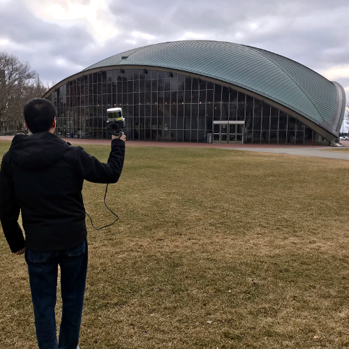
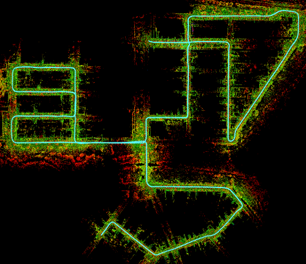
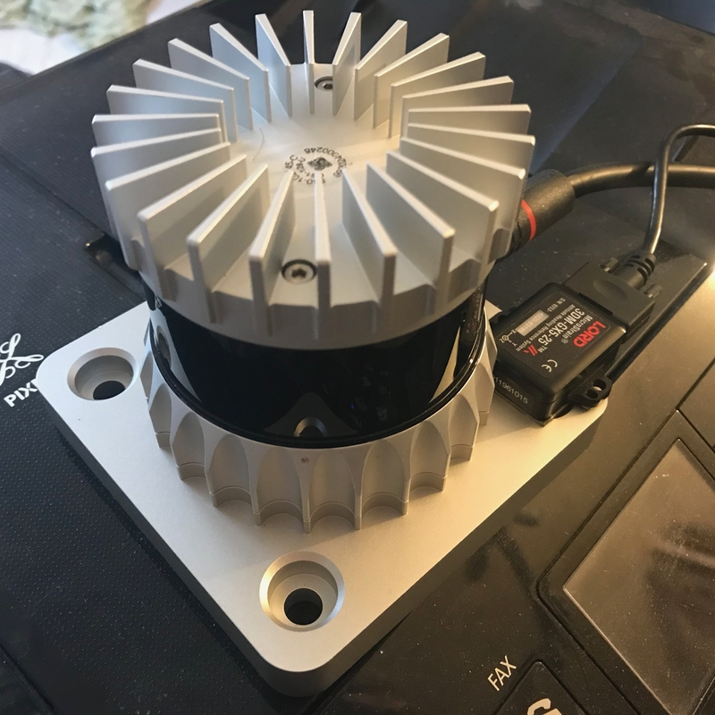

# LIO-SAM

<!-- VOXEL-MAP-ROS2-OVERVIEW:START -->

## LIO-SAM RTIOMS — Voxel Map ROS2 Research Branch

This repository is a research and engineering fork of ROS2 LIO-SAM. The `main` branch is retained as the LIO-SAM / RTIOMS comparison baseline. The `voxel-map-ros2` branch is reserved for integrating and evaluating a ROS2 Adaptive Voxel Map scan-to-map frontend.

The target environment is ROS2 Humble on Ubuntu 22.04, including WSL2 and native Linux. This branch is experimental and is not production-ready. No Adaptive Voxel Map source integration is included in this initial documentation commit.

### Repository Branch Overview

| Branch | Purpose | Current State |
| --- | --- | --- |
| `main` | LIO-SAM / RTIOMS comparison baseline | Baseline |
| `voxel-map-ros2` | Adaptive Voxel Map ROS2 integration and experiments | Experimental integration branch |

```bash
cd ~/ros2_ws/src
git clone https://github.com/YHH-jimmy/LIO-SAM_rtioms.git
cd LIO-SAM_rtioms
git checkout voxel-map-ros2
cd ..
colcon build --symlink-install
```

The `voxel-map-ros2` branch is currently an experimental integration branch and may not yet contain the Adaptive Voxel Map implementation.

### Current Project Status

| Component | Status | Notes |
| --- | --- | --- |
| ROS2 LIO-SAM baseline | Available | Existing repository baseline |
| LIO-SAM deskew cloud export | Verified | PointCloud2 output verified with frame `velodyne` in the current M2DGR experiment |
| Standalone ROS2 VoxelMap reference | Experimental | Developed and validated in a separate workspace |
| Adaptive voxel initial map construction | Verified in standalone test | Initial root voxel map can be created |
| Adaptive voxel lookup | Verified in standalone test | Root voxel lookup produced valid matches |
| Planar correspondence generation | Verified in standalone test | Planar leaf and point-to-plane correspondences were produced |
| Optimizer numerical stability | Failing | A non-finite optimizer update was observed |
| Continuous adaptive map update | Blocked | Blocked by the optimizer failure |
| LIO-SAM and VoxelMap integration | Not Implemented | Planned for this branch |
| Adaptive voxel RViz visualization | Not Implemented | Plane, leaf and voxel visualization is planned |
| Full trajectory evaluation | Not Completed | Requires stable registration first |

This status describes current research evidence. It must not be interpreted as a completed LIO-SAM and Adaptive Voxel Map integration.

### Research Goal

- Replace or augment the existing LIO-SAM feature-based scan-to-map frontend with an Adaptive Voxel Map frontend.
- Preserve LIO-SAM deskewing, IMU preintegration and factor-graph backend where applicable.
- Evaluate voxel-based plane constraints in geometrically degenerate environments.
- Provide reproducible ROS2 bag, diagnostic, frame-trace, runtime and trajectory comparisons.

```text
LiDAR PointCloud2
  -> LIO-SAM deskew
  -> Adaptive Voxel preprocessing
  -> voxel and planar correspondence
  -> scan-to-map optimizer
  -> keyframe and map update
  -> LIO-SAM factor-graph backend
```

This is the target architecture. It is not the currently completed architecture of the branch.

### Branch Strategy

| Branch Pattern | Purpose |
| --- | --- |
| `main` | Stable LIO-SAM / RTIOMS comparison baseline |
| `voxel-map-ros2` | Adaptive Voxel Map integration branch |
| `feature/voxel-core-integration` | Future isolated VoxelMap core integration work |
| `feature/voxel-visualization` | Future adaptive voxel visualization work |
| `feature/optimizer-monitoring` | Future optimizer monitoring work |
| `experiment/m2dgr-door02` | Future M2DGR experiment work |
| `experiment/hilti-elevator` | Future HILTI/elevator experiment work |

Only `main` and `voxel-map-ros2` are created or used in this task. The other names are documented conventions only.

### Version Comparison Plan

| Version | Deskew | Frontend Representation | Registration | Backend | Purpose |
| --- | --- | --- | --- | --- | --- |
| `main` baseline | LIO-SAM | Corner and surface features | Feature scan-to-map | iSAM2 factor graph | Baseline |
| Standalone VoxelMap reference | External deskew cloud | Adaptive voxel and planar representation | Voxel point-to-plane optimizer | None | Core validation |
| `voxel-map-ros2` target | LIO-SAM | Adaptive voxel and planar representation | Integrated voxel scan-to-map | LIO-SAM backend | Proposed system |

Metrics: source/callback frame count and completeness, input/finite/downsampled points, lookup/root/planar-leaf/correspondence counts, optimizer and feature runtime, registration/map-update rate, APE/RPE when valid, CPU/memory, trajectory duration, and map geometry quality.

### Current Standalone Experimental Evidence

These results were produced by a separate standalone ROS2 VoxelMap validation workspace. They were not produced by an Adaptive Voxel Map implementation integrated into this repository branch.

- Dataset: M2DGR `door_02` partial deskew recording
- Input topic: `/rtioms_v1_liosam/deskew/cloud_deskewed`
- Input type: `sensor_msgs/msg/PointCloud2`
- Input frame: `velodyne`

| Item | Observed Value |
| --- | --- |
| Initial adaptive voxel map | Created |
| Initial root voxels | 2617 |
| Frame 2 input points | 50302 |
| Frame 2 lookup entry points | 7584 |
| Frame 2 root voxel found | 1622 |
| Frame 2 planar leaf found | 2412 lookup hits |
| Frame 2 accepted correspondences | 1100 |
| Optimizer called | Yes |
| Optimizer translation update | Non-finite |
| Optimizer rotation update | Non-finite |
| Registration success in the referenced run | 0 |
| Continuous map update | Blocked after optimizer failure |

`planar leaf found = 2412` is a lookup-hit statistic and must not be interpreted as 2412 unique adaptive voxel leaves. These results are included only as integration-planning evidence.

### Known Limitations

- The current standalone optimizer can produce non-finite updates.
- The adaptive voxel map initializes but does not continue updating after the observed failure.
- `/voxelmap_reference/cloud_current` is the accepted current scan representation and is not the Adaptive Voxel Map.
- Adaptive voxel leaf, plane-center, voxel-boundary and plane-normal visualization has not been implemented.
- The current M2DGR deskew recording is a partial sequence.
- Full comparison requires stable callback delivery and a numerically stable optimizer.
- Dataset-specific frame IDs and parameters must not be assumed globally.
- Topic publication alone does not prove registration success or map-update success.

### Planned Development Phases

#### Phase 0 — Baseline Preservation
- Record the `main` baseline commit; preserve behavior and repeatable evaluation outputs.

#### Phase 1 — VoxelMap Core Import
- Import ROS-independent core with upstream licensing, attribution and source/commit provenance.

#### Phase 2 — ROS2 Adapter
- Consume deskewed PointCloud2; validate fields, timestamps and frames; publish diagnostics and per-frame traces.

#### Phase 3 — Adaptive Voxel Visualization
- Publish plane centers, voxel layers/boundaries and normals; distinguish scan, lookup, correspondence and accumulated map.

#### Phase 4 — Optimizer Stabilization
- Identify the first non-finite stage with observation-only diagnostics; establish root cause before fixes.

#### Phase 5 — LIO-SAM Integration
- Connect voxel registration while preserving IMU preintegration/factor-graph interfaces and baseline comparison.

#### Phase 6 — Evaluation
- Compare `main` and `voxel-map-ros2` on M2DGR, prepared HILTI/elevator and degenerate-environment sequences.

### Reproducibility Record

```text
Repository:
Repository branch:
Commit SHA:
Baseline commit SHA:
ROS distribution:
Ubuntu version:
Execution environment:
Dataset:
Bag path:
Input topic:
Input message type:
Input frame:
Playback rate:
Configuration profile:
Result directory:
Source frame count:
Callback frame count:
Registration success:
Map update count:
APE:
RPE:
Runtime:
Known failure:
Notes:
```

### Adaptive Voxel Map Upstream Attribution

Upstream VoxelMap repository: <https://github.com/hku-mars/VoxelMap>

Pinned reference commit: `d787ee8ccfb0e509a36adb2c52bd5da97b29c39a`

The actual source integration must preserve the upstream GPL license, copyright notices and attribution. No claim is made that upstream VoxelMap source has already been merged into this branch.

<!-- VOXEL-MAP-ROS2-OVERVIEW:END -->

## Original LIO-SAM Documentation

**A real-time lidar-inertial odometry package. We strongly recommend the users read this document thoroughly and test the package with the provided dataset first. A video of the demonstration of the method can be found on [YouTube](https://www.youtube.com/watch?v=A0H8CoORZJU).**

<p align='center'>
    
</p>

<p align='center'>
    
    
    
    
</p>

## Menu

  - [**System architecture**](#system-architecture)

  - [**Notes on ROS2 branch**](#notes-on-ros2-branch)

  - [**Package dependency**](#dependency)

  - [**Package install**](#install)

  - [**Prepare lidar data**](#prepare-lidar-data) (must read)

  - [**Prepare IMU data**](#prepare-imu-data) (must read)

  - [**Sample datasets**](#sample-datasets)

  - [**Run the package**](#run-the-package)

  - [**Other notes**](#other-notes)

  - [**Issues**](#issues)

  - [**Paper**](#paper)

  - [**TODO**](#todo)

  - [**Related Package**](#related-package)

  - [**Acknowledgement**](#acknowledgement)

## System architecture

<p align='center'>
    
</p>

We design a system that maintains two graphs and runs up to 10x faster than real-time.
  - The factor graph in "mapOptimization.cpp" optimizes lidar odometry factor and GPS factor. This factor graph is maintained consistently throughout the whole test.
  - The factor graph in "imuPreintegration.cpp" optimizes IMU and lidar odometry factor and estimates IMU bias. This factor graph is reset periodically and guarantees real-time odometry estimation at IMU frequency.

## Notes on ROS2 branch

There are some features of the original ROS1 version that are currently missing in this ROS2 version, namely:
- Testing with Velodyne & Livox lidars and Microstrain IMUs
- A launch file for the navsat module/GPS factor
- The rviz2 configuration misses many elements

This branch was tested with Ouster lidars, Xsens IMUs and SBG-Systems IMUs using the following ROS2 drivers:
- [ros2_ouster_drivers](https://github.com/ros-drivers/ros2_ouster_drivers)
- [bluespace_ai_xsens_ros_mti_driver](https://github.com/bluespace-ai/bluespace_ai_xsens_ros_mti_driver)
- [sbg_ros2_driver](https://github.com/SBG-Systems/sbg_ros2_driver)

In these tests, the IMU was mounted on the bottom of the lidar such that their x-axes pointed in the same direction. The parameters `extrinsicRot` and `extrinsicRPY` in `params.yaml` correspond to this constellation.

## Dependencies

Tested with ROS2 versions foxy and galactic on Ubuntu 20.04 and humble on Ubuntu 22.04
- [ROS2](https://docs.ros.org/en/humble/Installation.html)
  ```
  sudo apt install ros-<ros2-version>-perception-pcl \
		   ros-<ros2-version>-pcl-msgs \
		   ros-<ros2-version>-vision-opencv \
		   ros-<ros2-version>-xacro
  ```
- [gtsam](https://gtsam.org/get_started) (Georgia Tech Smoothing and Mapping library)
  ```
  # Add GTSAM-PPA
  sudo add-apt-repository ppa:borglab/gtsam-release-4.1
  sudo apt install libgtsam-dev libgtsam-unstable-dev
  ```

## Install

Use the following commands to download and compile the package.

  ```
  cd ~/ros2_ws/src
  git clone https://github.com/TixiaoShan/LIO-SAM.git
  cd LIO-SAM
  git checkout ros2
  cd ..
  colcon build
  ```

## Using Docker

Build image (based on ROS2 Humble):

```
docker build -t liosam-humble-jammy .
```

Once you have the image, you can start a container by using one of the following methods:

1. `docker run`

```
docker run --init -it -d \
  --name liosam-humble-jammy-container \
  -v /etc/localtime:/etc/localtime:ro \
  -v /etc/timezone:/etc/timezone:ro \
  -v /tmp/.X11-unix:/tmp/.X11-unix \
  -e DISPLAY=$DISPLAY \
  --runtime=nvidia --gpus all \
  liosam-humble-jammy \
  bash
```

2. `docker compose`

Start a docker compose container:

```
docker compose up -d
```

Stopping a docker compose container:
```
docker compose down
```

To enter into the running container use:

```
docker exec -it liosam-humble-jammy-container bash
```
## Prepare lidar data

The user needs to prepare the point cloud data in the correct format for cloud deskewing, which is mainly done in "imageProjection.cpp". The two requirements are:
  - **Provide point time stamp**. LIO-SAM uses IMU data to perform point cloud deskew. Thus, the relative point time in a scan needs to be known. The up-to-date Velodyne ROS driver should output this information directly. Here, we assume the point time channel is called "time." The definition of the point type is located at the top of the "imageProjection.cpp." "deskewPoint()" function utilizes this relative time to obtain the transformation of this point relative to the beginning of the scan. When the lidar rotates at 10Hz, the timestamp of a point should vary between 0 and 0.1 seconds. If you are using other lidar sensors, you may need to change the name of this time channel and make sure that it is the relative time in a scan.
  - **Provide point ring number**. LIO-SAM uses this information to organize the point correctly in a matrix. The ring number indicates which channel of the sensor that this point belongs to. The definition of the point type is located at the top of "imageProjection.cpp." The up-to-date Velodyne ROS driver should output this information directly. Again, if you are using other lidar sensors, you may need to rename this information. Note that only mechanical lidars are supported by the package currently.

## Prepare IMU data

  - **IMU requirement**. Like the original LOAM implementation, LIO-SAM only works with a 9-axis IMU, which gives roll, pitch, and yaw estimation. The roll and pitch estimation is mainly used to initialize the system at the correct attitude. The yaw estimation initializes the system at the right heading when using GPS data. Theoretically, an initialization procedure like VINS-Mono will enable LIO-SAM to work with a 6-axis IMU. The performance of the system largely depends on the quality of the IMU measurements. The higher the IMU data rate, the better the system accuracy. We use Microstrain 3DM-GX5-25, which outputs data at 500Hz. We recommend using an IMU that gives at least a 200Hz output rate. Note that the internal IMU of Ouster lidar is an 6-axis IMU.

  - **IMU alignment**. LIO-SAM transforms IMU raw data from the IMU frame to the Lidar frame, which follows the ROS REP-105 convention (x - forward, y - left, z - upward). To make the system function properly, the correct extrinsic transformation needs to be provided in "params.yaml" file. **The reason why there are two extrinsics is that my IMU (Microstrain 3DM-GX5-25) acceleration and attitude have different coordinates. Depending on your IMU manufacturer, the two extrinsics for your IMU may or may not be the same**.
    - "extrinsicRot" in "params.yaml" is a rotation matrix that transforms IMU gyro and acceleometer measurements to lidar frame.
    - "extrinsicRPY" in "params.yaml" is a rotation matrix that transforms IMU orientation to lidar frame.

  - **IMU debug**. It's strongly recommended that the user uncomment the debug lines in "imuHandler()" of "imageProjection.cpp" and test the output of the transformed IMU data. The user can rotate the sensor suite to check whether the readings correspond to the sensor's movement. A YouTube video that shows the corrected IMU data can be found [here (link to YouTube)](https://youtu.be/BOUK8LYQhHs).


<p align='center'>
    
</p>
<p align='center'>
    
</p>

## Sample datasets

For privacy reasons, no data set can currently be made available for ROS2.

README.md of the master branch contains some links to ROS1 rosbags. It is possible to use [ros1_bridge](https://github.com/ros2/ros1_bridge) with these rosbags, but verify timing behavior (message frequency in ROS2) first. Mind [DDS tuning](https://docs.ros.org/en/humble/How-To-Guides/DDS-tuning.html).

## Run the package

1. Run the launch file:
```
ros2 launch lio_sam run.launch.py
```

2. Play existing bag files:
```
ros2 bag play your-bag.bag
```

## Save map
```
ros2 service call /lio_sam/save_map lio_sam/srv/SaveMap
```
```
ros2 service call /lio_sam/save_map lio_sam/srv/SaveMap "{resolution: 0.2, destination: /Downloads/service_LOAM}"
```
## Other notes

  - **Loop closure:** The loop function here gives an example of proof of concept. It is directly adapted from LeGO-LOAM loop closure. For more advanced loop closure implementation, please refer to [ScanContext](https://github.com/irapkaist/SC-LeGO-LOAM). Set the "loopClosureEnableFlag" in "params.yaml" to "true" to test the loop closure function. In Rviz, uncheck "Map (cloud)" and check "Map (global)". This is because the visualized map - "Map (cloud)" - is simply a stack of point clouds in Rviz. Their postion will not be updated after pose correction. The loop closure function here is simply adapted from LeGO-LOAM, which is an ICP-based method. Because ICP runs pretty slow, it is suggested that the playback speed is set to be "-r 1". You can try the Garden dataset for testing.

<p align='center'>
    
    
</p>

  - **Using GPS:** The park dataset is provided for testing LIO-SAM with GPS data. This dataset is gathered by [Yewei Huang](https://robustfieldautonomylab.github.io/people.html). To enable the GPS function, change "gpsTopic" in "params.yaml" to "odometry/gps". In Rviz, uncheck "Map (cloud)" and check "Map (global)". Also check "Odom GPS", which visualizes the GPS odometry. "gpsCovThreshold" can be adjusted to filter bad GPS readings. "poseCovThreshold" can be used to adjust the frequency of adding GPS factor to the graph. For example, you will notice the trajectory is constantly corrected by GPS whey you set "poseCovThreshold" to 1.0. Because of the heavy iSAM optimization, it's recommended that the playback speed is "-r 1".

<p align='center'>
    
</p>

  - **KITTI:** Since LIO-SAM needs a high-frequency IMU for function properly, we need to use KITTI raw data for testing. One problem remains unsolved is that the intrinsics of the IMU are unknown, which has a big impact on the accuracy of LIO-SAM. Download the provided sample data and make the following changes in "params.yaml":
    - extrinsicTrans: [-8.086759e-01, 3.195559e-01, -7.997231e-01]
    - extrinsicRot: [9.999976e-01, 7.553071e-04, -2.035826e-03, -7.854027e-04, 9.998898e-01, -1.482298e-02, 2.024406e-03, 1.482454e-02, 9.998881e-01]
    - extrinsicRPY: [9.999976e-01, 7.553071e-04, -2.035826e-03, -7.854027e-04, 9.998898e-01, -1.482298e-02, 2.024406e-03, 1.482454e-02, 9.998881e-01]
    - N_SCAN: 64
    - downsampleRate: 2 or 4
    - loopClosureEnableFlag: true or false

<p align='center'>
    
    
</p>

  - **Ouster lidar:** To make LIO-SAM work with Ouster lidar, some preparations needs to be done on hardware and software level.
    - Hardware:
      - Use an external IMU. LIO-SAM does not work with the internal 6-axis IMU of Ouster lidar. You need to attach a 9-axis IMU to the lidar and perform data-gathering.
      - Configure the driver. Change "timestamp_mode" in your Ouster launch file to "TIME_FROM_PTP_1588" so you can have ROS format timestamp for the point clouds.
    - Config:
      - Change "sensor" in "params.yaml" to "ouster".
      - Change "N_SCAN" and "Horizon_SCAN" in "params.yaml" according to your lidar, i.e., N_SCAN=128, Horizon_SCAN=1024.
    - Gen 1 and Gen 2 Ouster:
      It seems that the point coordinate definition might be different in different generations. Please refer to [Issue #94](https://github.com/TixiaoShan/LIO-SAM/issues/94) for debugging.

<p align='center'>
    
    
</p>

## Issues

  - **Zigzag or jerking behavior**: if your lidar and IMU data formats are consistent with the requirement of LIO-SAM, this problem is likely caused by un-synced timestamp of lidar and IMU data.

  - **Jumpping up and down**: if you start testing your bag file and the base_link starts to jump up and down immediately, it is likely your IMU extrinsics are wrong. For example, the gravity acceleration has negative value.

  - **mapOptimization crash**: it is usually caused by GTSAM. Please install the GTSAM specified in the README.md. More similar issues can be found [here](https://github.com/TixiaoShan/LIO-SAM/issues).

  - **gps odometry unavailable**: it is generally caused due to unavailable transform between message frame_ids and robot frame_id (for example: transform should be available from "imu_frame_id" and "gps_frame_id" to "base_link" frame. Please read the Robot Localization documentation found [here](http://docs.ros.org/en/melodic/api/robot_localization/html/preparing_sensor_data.html).

## Paper

Thank you for citing [LIO-SAM (IROS-2020)](./config/doc/paper.pdf) if you use any of this code.
```
@inproceedings{liosam2020shan,
  title={LIO-SAM: Tightly-coupled Lidar Inertial Odometry via Smoothing and Mapping},
  author={Shan, Tixiao and Englot, Brendan and Meyers, Drew and Wang, Wei and Ratti, Carlo and Rus Daniela},
  booktitle={IEEE/RSJ International Conference on Intelligent Robots and Systems (IROS)},
  pages={5135-5142},
  year={2020},
  organization={IEEE}
}
```

Part of the code is adapted from [LeGO-LOAM](https://github.com/RobustFieldAutonomyLab/LeGO-LOAM).
```
@inproceedings{legoloam2018shan,
  title={LeGO-LOAM: Lightweight and Ground-Optimized Lidar Odometry and Mapping on Variable Terrain},
  author={Shan, Tixiao and Englot, Brendan},
  booktitle={IEEE/RSJ International Conference on Intelligent Robots and Systems (IROS)},
  pages={4758-4765},
  year={2018},
  organization={IEEE}
}
```

## TODO

  - [ ] [Bug within imuPreintegration](https://github.com/TixiaoShan/LIO-SAM/issues/104)

## Related Package

  - [Lidar-IMU calibration](https://github.com/chennuo0125-HIT/lidar_imu_calib)
  - [LIO-SAM with Scan Context](https://github.com/gisbi-kim/SC-LIO-SAM)

## Acknowledgement

  - LIO-SAM is based on LOAM (J. Zhang and S. Singh. LOAM: Lidar Odometry and Mapping in Real-time).
