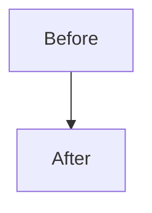
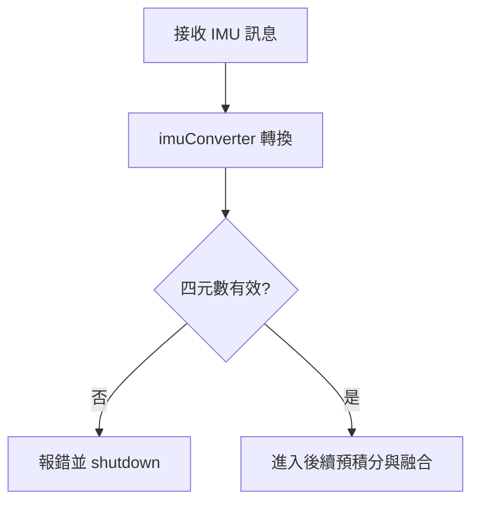
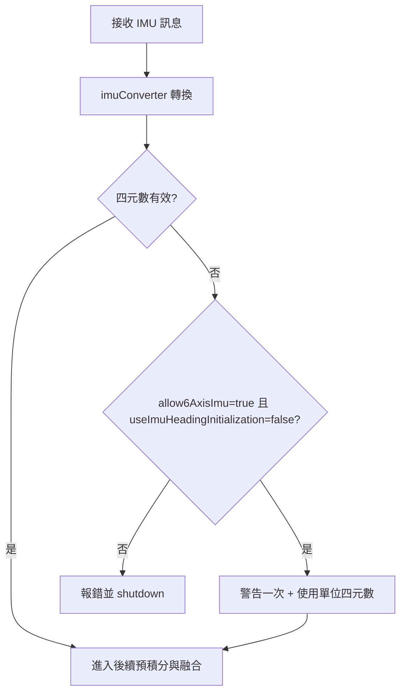

# 修改日誌

本檔用途: 長期記錄研究修改，讓後續研究員可追溯「為何改、改了什麼、怎麼改、流程是否改變」。

## 使用規範

1. 新修改一律新增在最上方（最新在前）。
2. 每筆至少包含四段:
- 為了什麼修改（Issue）
- 修改了什麼（內容）
- 修改流程
- 與原先專案流程圖有變化嗎
3. 若流程有改動，必須附 Mermaid 圖。
4. 每筆要列出影響檔案清單。
5. 若有參數切換，需提供行為對照表。

## 快速模板（複製後填寫）

```md
## [YYYY-MM-DD] <主題>

### 為了什麼修改（Issue）
1. 問題描述
- 
2. 研究需求
- 
3. 目標
- 

### 修改了什麼（內容）
1. 變更摘要
- 
2. 影響檔案
- 

### 修改流程
1. 
2. 
3. 

### 與原先專案流程圖有變化嗎
- 結論: 有 / 無
- 說明:



### 參數/行為對照（若無可省略）
| 參數組合 | 行為 |
|---|---|
|  |  |

### 風險與驗證
1. 風險:
- 
2. 驗證:
- 
```

## 變更索引

1. 2026-03-31: 6軸 IMU 相容性與切換參數

---

## [2026-03-31] 6軸 IMU 相容性與切換參數

### 為了什麼修改（Issue）
1. 問題描述
- 原始程式在 `imuConverter()` 中，若 IMU orientation 四元數無效，會直接報錯並關閉節點。
- 這會讓只有 6軸 IMU（加速度計 + 陀螺儀）且未提供有效 orientation 的平台無法運行。

2. 研究需求
- 本研究情境不使用 GPS（不需要 GPS heading 初始化）。
- 需要保留同一份程式碼，讓不同硬體條件可透過參數切換使用。

3. 目標
- 不破壞原本安全行為的前提下，新增可切換機制，允許 6軸 IMU 模式。

### 修改了什麼（內容）
1. 新增參數開關
- 檔案: `include/lio_sam/utility.hpp`
- 新增成員: `bool allow6AxisImu;`
- 新增參數宣告與讀取:
  - `declare_parameter("allow6AxisImu", false);`
  - `get_parameter("allow6AxisImu", allow6AxisImu);`

2. 調整四元數檢查邏輯
- 檔案: `include/lio_sam/utility.hpp`（函式 `imuConverter()`）
- 變更後行為:
  - 條件 A: `allow6AxisImu=false` 或 `useImuHeadingInitialization=true`
    - 無效四元數時: 報錯並停止節點（維持原本嚴格模式）
  - 條件 B: `allow6AxisImu=true` 且 `useImuHeadingInitialization=false`
    - 無效四元數時: 警告一次後繼續運行
    - orientation 會被設為單位四元數 `(0,0,0,1)`

3. 參數檔更新
- 檔案: `config/params.yaml`
- 新增: `allow6AxisImu: true`
- 用意: 預設先套用 6軸模式，符合目前研究需求。

### 修改流程
1. 釐清需求
- 確認不使用 GPS，且需支援 6軸 IMU。

2. 風險界定
- 保留原本預設安全行為（新參數預設值為 `false`）。
- 僅在 `allow6AxisImu=true` 且 `useImuHeadingInitialization=false` 時放寬。

3. 實作
- 在 `ParamServer` 增加可配置開關。
- 在 `imuConverter()` 依參數路徑分流處理。
- 在 `params.yaml` 寫入研究場景建議值。

4. 驗證
- 檢查編輯後檔案無語法錯誤。
- 啟動時若四元數無效，應符合對照行為表。

### 與原先專案流程圖有變化嗎
- 結論: 有
- 說明: 僅在「IMU四元數檢查」新增可切換分支；其餘 LIO-SAM 主流程不變。

原本流程（簡化）:



修改後流程（簡化）:



### 參數/行為對照

| allow6AxisImu | useImuHeadingInitialization | 四元數無效時行為 |
|---|---|---|
| false | false | 報錯並停止 |
| false | true  | 報錯並停止 |
| true  | true  | 報錯並停止 |
| true  | false | 警告一次，設為單位四元數並繼續 |

### 風險與驗證
1. 風險
- 無 GPS 的長時間運行可能出現漂移，屬系統特性，非本次修改引入。

2. 驗證
- 啟動後確認沒有因 `Invalid IMU quaternion` 直接退出。
- 首次偵測無效四元數時，應只看到一次 warning。
